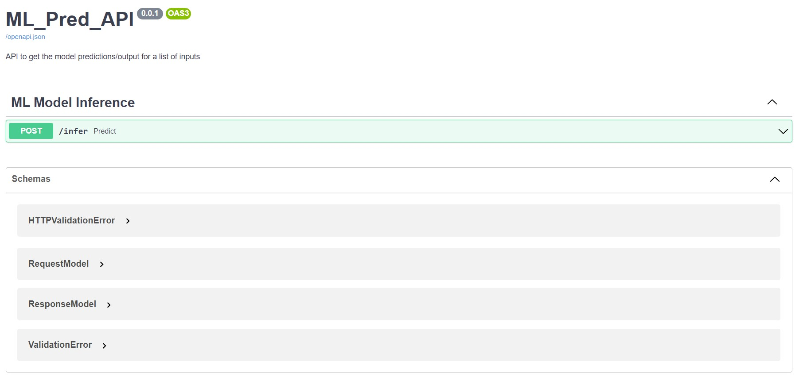
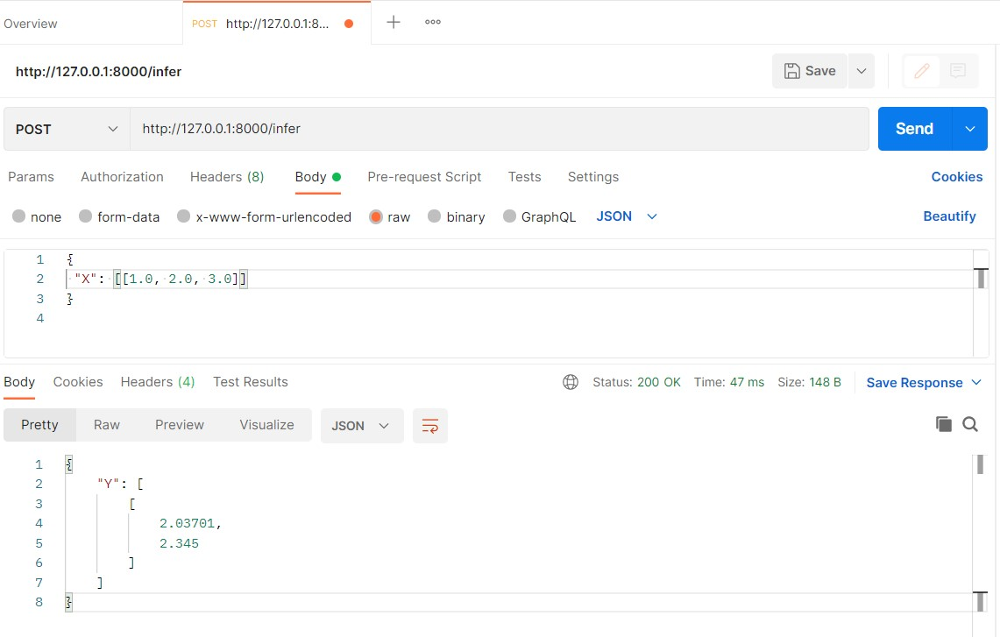

# Example API Server
[](https://github.com/choukha/example-api-server/actions/workflows/code-quality.yaml)

This repo includes a basic API setup using [FastAPI](https://fastapi.tiangolo.com/).

To get started with this repo :

1. First clone the repository & navigate to the root folder of repository, example such as
```
git clone git@github.com:choukha/example-api-server.git
```
## Running the App locally
### Method1 : Using Poetry (preferred method)
2. Make sure that you've [poetry](https://python-poetry.org/) installed.
Also change the following setting in `poetry`
```
poetry config virtualenvs.in-project true
```
Open the repo in IDE (e.g. VS code) and run the following command in the terminal/commandline after navigating to the repo folder, this installs the dependencies defined in the `pyproject.toml` file.
```
poetry install
```

### Method2 : Using requirements.txt file
3. Create a virtual environment
```
python3.8 -m venv .venv
```
4. Activate the environment. Run:
```
source .venv/bin/activate
```
5. Install the dependencies. Run:
```
pip install -r requirements.txt
```
### After Method1 or Method2 is finished
6. Start the web server
```
uvicorn app.main:app --port 8000 --reload
```
### Test the API in browser
7. After running command in step6 above, Go to this URL for api docs `http://localhost:8000/docs` and expand and play with the API.


### Test the API in postman
8. Open the postman and enter the infer route URL `http://127.0.0.1:8000/infer`, Select the POST method and send the Body data by selecting "raw" and JSON format.


## Running the App in containers using Docker
You need to have Docker installed, then you can run the command below in terminal, from root folder.
Build the docker image
```
docker build -t app .
```
Now run the app from image
```
docker run -d --name example-api -p 5000:5000 app
```
Now open the `http://localhost:5000/docs` to check the application running on Docker.

### Pushing the image to container registry
You can also push the image to a container registry and pull from there to use it.
Make sure, you have the repositories in the registry to push to.
```
docker tag app dockerhub_username/reponame:app
docker push dockerhub_username/reponame:app
```

### Pulling the pre-built image and run it
```
docker run -p 5000:5000 --expose 5000 dockerhub_username/reponame:app
```
Now go to the URL to check if it's running
`http://localhost:5000/docs`